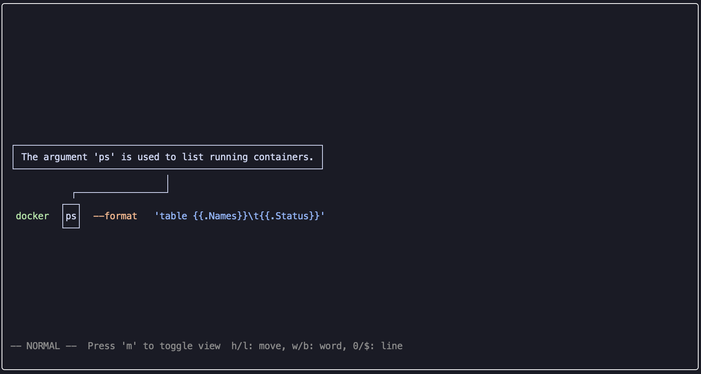

# scute - AI Shell Assistant


## Purpose / Goal

`scute` is a CLI companion for your shell. It adds fast, context-aware command generation, suggestion, and explanation directly in your terminal workflow. The goal is to reduce friction when crafting commands by:

- Generating commands from natural language prompts
- Suggesting completions for partially typed commands
- Explaining commands without disrupting your prompt
- Integrating through lightweight keybindings and shell hooks

The name comes from the scute, the protective shell plate on a turtle, and the tool itself is meant to assist with shell commands.

Scute is built with Bun and can be installed via npm (requires Bun), Homebrew, or downloaded as a prebuilt binary.

## Demo

Below is a screenshot of the interactive annotated token view:



## Installation

Supported platforms: macOS and Linux (x86_64 and arm64).

### A. Homebrew (Recommended - Prebuilt Binary)

```sh
brew tap napisani/scute https://github.com/napisani/scute
brew install scute
```

### B. Install via curl (install.sh)

Convenience installer (requires `curl` and `tar`):

```sh
curl -fsSL https://raw.githubusercontent.com/napisani/scute/main/scripts/install.sh | bash
```

By default it installs into `/usr/local/bin` and pulls the latest release. Pass `vX.Y.Z` and a custom directory to override.

### C. bunx / bun (Requires Bun)

Install globally:

```sh
bun install -g @napisani/scute
```

Or run once with:

```sh
bunx @napisani/scute --help
```

> **Note:** The npm package requires Bun to be installed on your system. Install Bun from [bun.sh](https://bun.sh).

### D. npm / npx (Requires Bun)

Install globally:

```sh
npm install -g @napisani/scute
```

Or run once with:

```sh
npx @napisani/scute --help
```

> **Note:** The npm package requires Bun to be installed on your system.

### E. Nix

Add the repo as an input and use it in your Home Manager flake:

```nix
inputs.scute.url = "github:napisani/scute";

outputs = { self, nixpkgs, scute, ... }: {
  homeConfigurations.me = nixpkgs.lib.homeManagerConfiguration {
    # ...
    packages = [ scute.packages.${pkgs.system}.default ];
  };
};
```

> The repository ships an intentionally minimal `flake.nix`. Run `nix flake lock --update-input scute` inside your own workspace to pin exact revisions.

### F. Prebuilt Binaries (Manual)

Every Git tag publishes macOS (x86_64, arm64) and Linux (x86_64) archives on the [GitHub Releases](https://github.com/napisani/scute/releases) page. Download the archive for your platform, unpack it, and move the `scute` binary onto your `PATH`:

```sh
curl -L -o scute.tar.gz "https://github.com/napisani/scute/releases/download/vX.Y.Z/scute-vX.Y.Z-macos-arm64.tar.gz"
tar -xzf scute.tar.gz
sudo mv scute /usr/local/bin/
```

Verify downloads with the checksums shipped alongside each release:

```sh
curl -LO https://github.com/napisani/scute/releases/download/vX.Y.Z/checksums.txt
grep scute-vX.Y.Z-macos-arm64.tar.gz checksums.txt | shasum -a 256 -c -
```

### G. Install from Source

```sh
git clone https://github.com/napisani/scute.git
cd scute
bun install --frozen-lockfile
bun run build:bin
sudo mv dist/scute /usr/local/bin/
```

Or use Make targets:

```sh
make build
sudo mv dist/scute /usr/local/bin/
```

## Configuration

Scute reads configuration from `~/.config/scute/config.yaml` by default. You can override it per invocation with `--config <path>`.

### Precedence

1. `--config <path>` (explicit CLI override)
2. Environment variables (provider keys, defaults)
3. Config file defaults (schema defaults)

Notes:
- `dotenv/config` is loaded at startup, so values in `.env` will be respected.
- Provider env vars (e.g., `OPENAI_API_KEY`) merge into `providers` and override matching entries.

### Prompt defaults

Use `promptDefaults` to set shared values for all prompts. Any field omitted on a prompt inherits the value from `promptDefaults`. You can still override individual prompts under `prompts`, including `output` via `prompts.<name>.output`.

### Output channels

Output channels control how scute emits results when `--output` is not provided.

- `clipboard`: writes the result to the system clipboard using `clipboardCommand` (or auto-detected clipboard tool). Falls back to stdout if no clipboard command is found.
- `stdout`: prints the result to stdout with a trailing newline.
- `prompt`: renders the result at the bottom of the terminal without altering your current input line.
- `readline`: replaces the current input line (bash/zsh integration).

`--output <channel>` always overrides the config for a single invocation.

Note: `scute build` ignores `--output`. Output is chosen inside the TUI via leader-key commands (e.g., `leader` + `enter` for stdout).

### Minimal config example

```yaml
# ~/.config/scute/config.yaml

# Use a compact view for the token editor
# viewMode values: horizontal | vertical
viewMode: horizontal

# Define at least one provider for prompts
# provider name values: openai | anthropic | gemini | ollama
providers:
  - name: openai
    apiKey: ${OPENAI_API_KEY}

# Optional: adjust shell keybindings (universal syntax)
shellKeybindings:
  explain: ""
  build: ""
  suggest: ""
  generate: ""
  choose: "Ctrl+E"
```

### Fully configured example

```yaml
# ~/.config/scute/config.yaml

# Layout for the interactive token editor
# viewMode values: horizontal | vertical
viewMode: horizontal # horizontal -> annotated view, vertical -> list view

# Clipboard command for output channel "clipboard"
clipboardCommand: "pbcopy"

# Providers used by prompts (env vars override these)
# provider name values: openai | anthropic | gemini | ollama
providers:
  - name: openai
    apiKey: ${OPENAI_API_KEY}
  - name: anthropic
    apiKey: ${ANTHROPIC_API_KEY}
  - name: gemini
    apiKey: ${GEMINI_API_KEY}
  - name: ollama
    baseUrl: ${OLLAMA_BASE_URL}

# Keybindings for the interactive token editor UI
normalKeybindings:
  up: ["up"]
  down: ["down"]
  left: ["left", "h"]
  right: ["right", "l"]
  wordForward: ["w"]
  wordBackward: ["b"]
  lineStart: ["0", "^"]
  lineEnd: ["$"]
  firstToken: ["g"]
  lastToken: ["G"]
  appendLine: ["A"]
  insert: ["i"]
  append: ["a"]
  change: ["c"]
  exitInsert: ["escape"]
  save: ["return"]

leaderKeybindings:
  explain: ["e"]
  toggleView: ["m"]
  quit: ["q"]
  outputClipboard: ["y"]
  outputReadline: ["r"]
  outputStdout: ["return"]
  outputPrompt: ["p"]

leaderKey: ["space"]

# Shell keybindings in universal syntax (rendered by scute init)
shellKeybindings:
  explain: ""
  build: ""
  suggest: ""
  generate: ""
  choose: "Ctrl+E"

# Theme colors (catppuccin defaults shown)
theme:
  tokenColors:
    command: "#A6E3A1"
    option: "#FAB387"
    argument: "#89B4FA"
    assignment: "#CBA6F7"
    pipe: "#94E2D5"
    controlOperator: "#F38BA8"
    redirect: "#CDD6F4"
    unknown: "#6C7086"
  tokenDescription: "#CDD6F4"
  markerColor: "#CDD6F4"

# Prompt defaults (apply to all prompts unless overridden)
promptDefaults:
  # provider values: openai | anthropic | gemini | ollama
  provider: openai
  model: gpt-4
  temperature: 0.7
  maxTokens: 128000
  userPrompt: ""
  systemPromptOverride: ""
  # output values: clipboard | stdout | prompt | readline
  output: readline

# Prompt behavior per command
prompts:
  explain:
    # output values: clipboard | stdout | prompt | readline
    output: prompt
  suggest:
    # output values: clipboard | stdout | prompt | readline
    output: readline
  generate:
    # output values: clipboard | stdout | prompt | readline
    output: readline
  describeTokens:
    # Internal prompt used by the token editor
```

### Environment variables

Provider credentials and defaults:

- `OPENAI_API_KEY`
- `ANTHROPIC_API_KEY`
- `GEMINI_API_KEY`
- `OLLAMA_BASE_URL`
- `SCUTE_DEFAULT_PROVIDER`
- `SCUTE_DEFAULT_MODEL`

Runtime behavior:

- `SCUTE_DEBUG` (set to `1` or `true` for verbose logging)
- `SCUTE_SHELL` (override detected shell name)
- `SHELL` (standard shell env var)
- `READLINE_LINE` (readline current line, when present)

## Shell Integration

`scute` integrates with your shell via a script that needs to be loaded by your shell's configuration file (e.g., `.bashrc`).

### For Bash

Add the following line to the end of your `~/.bashrc` file:

```sh
eval "$(scute init bash)"
```

After adding the line, restart your terminal or run `source ~/.bashrc` to apply the changes.

### For Nix/home-manager Users

If you use `home-manager` to manage your dotfiles, you cannot edit `.bashrc` directly. Instead, add the following to your `home.nix` configuration:

```nix
programs.bash = {
  enable = true;
  bashrcExtra = ''
    eval "$(scute init bash)"
  '';
};
```

Then, run `home-manager switch` to apply the configuration.

## Debug Logging

Set `SCUTE_DEBUG=1` to enable verbose logs. When enabled, `scute` writes detailed traces to `/tmp/scute.log`:

```sh
export SCUTE_DEBUG=1
tail -f /tmp/scute.log
```

### Inspect Resolved Configuration

Use the `config-debug` subcommand to print the fully resolved configuration (including environment overrides). This is useful when troubleshooting provider settings or custom config files:

```sh
scute --config configs/ollama-config.yml config-debug
```

The command prints a JSON payload containing the merged configuration and relevant environment variables.

## Testing

Scute uses three complementary testing strategies:

1. **Unit Tests** — Fast, deterministic tests for core logic
2. **Eval Tests** — AI-powered evaluations that validate LLM output quality
3. **PTY E2E Tests** — End-to-end shell integration tests in real terminals

### Unit Tests

Unit tests use Bun's built-in test runner and live in the `tests/` directory. They cover core logic, utilities, and component behavior without external dependencies.

```sh
# Run all unit tests
make test-unit

# Run with coverage
make test-coverage

# Run a specific test file
bun test tests/core/output.test.ts
```

**Key unit test areas:**

| File | Tests |
|------|-------|
| `tests/core/output.test.ts` | Output channel routing (stdout, clipboard, prompt, readline) |
| `tests/shells.test.ts` | Shell integration (bash/zsh/sh keybindings) |
| `tests/build-command.test.ts` | Build command argument resolution |
| `tests/config-overlay.test.ts` | Configuration merging and precedence |
| `tests/hooks/useVimMode.test.ts` | TUI vim navigation and editing |

### Eval Tests

Eval tests use the `.eval.test.ts` suffix and live in the `evals/` directory. These tests make real LLM calls and validate that the AI produces sensible output for specific tasks.

```sh
# Run all eval tests
make test-evals

# Run a specific eval
bun test evals/suggest-command.eval.test.ts
```

**Available evals:**

| File | Validates |
|------|-----------|
| `evals/suggest-command.eval.test.ts` | Suggest produces valid shell commands |
| `evals/explain-command.eval.test.ts` | Explain produces helpful explanations |
| `evals/ai-connectivity.eval.test.ts` | Provider connectivity and API responses |
| `evals/fetch-token-descriptions.eval.test.ts` | Token description fetching |

> **Note:** Eval tests require valid provider credentials (e.g., `OPENAI_API_KEY`) and make real API calls.

### PTY E2E Tests

PTY tests open a real pseudo-terminal, spawn a clean shell, initialize scute, and run scripted scenarios. These validate the full integration: shell keybindings, output channels, and TUI behavior in an actual terminal environment.

**Prerequisites:**
- `python3`
- `bun` (for `./bin/scute`)
- Provider credentials (e.g., `OPENAI_API_KEY`)

**Configuration:**
- Default config: `configs/agent-pty.yml` (uses OpenAI GPT-4o-mini, writes clipboard to `/tmp/scute-clipboard.txt`)
- Override with `--config <path>`

**Running scenarios:**

```sh
# Run ALL scenarios and get a pass/fail summary
make test-pty

# Run a single scenario by name
make test-pty-one SCENARIO=suggest-stdout
make test-pty-one SCENARIO=explain-stdout
make test-pty-one SCENARIO=clipboard-file

# Or run directly with extra options
scripts/agent/run-one suggest-stdout --shell zsh
scripts/agent/run-all --config configs/openai-config.yml --quiet
```

**Available scenarios:**

| Scenario | Tests |
|----------|-------|
| `suggest-stdout` | `scute suggest` via CLI with stdout output |
| `suggest-readline` | Alt+G keybinding replaces readline buffer |
| `explain-stdout` | `scute explain` via CLI with stdout output |
| `explain-keybinding` | Ctrl+E keybinding shows prompt hint |
| `build-stdout` | TUI opens, submit with Enter |
| `generate-stdout` | `scute generate` via CLI with stdout output |
| `clipboard-file` | Clipboard output writes to file |

**Logs:** Each scenario writes a log to `/tmp/scute-pty-<scenario>.log` for debugging.

**Scenario step types:** Each scenario is a JSON file with steps like:

```json
{
  "prompt": "scute-test$ ",
  "steps": [
    {"send_line": "export PS1=\"scute-test$ \""},
    {"wait_for_prompt": true},
    {"send_line": "scute suggest \"git sta\" --output stdout"},
    {"wait_for_prompt": true, "timeout": 15},
    {"assert_output_contains": "git"}
  ]
}
```

Available steps: `send_line`, `send_text`, `send_keys`, `sleep`, `wait_for_prompt`, `wait_for_text`, `assert_output_contains`, `assert_file_exists`, `assert_file_contains`, `clear_buffer`, `drain`, `delete_file`.

**Agent prompt templates:**

```text
Run scripts/agent/run-one suggest-stdout. If it fails, read /tmp/scute-pty-suggest-stdout.log (last 120 lines) and diagnose the issue.
```

```text
Run scripts/agent/run-all and report the pass/fail summary. For any failures, include the last 120 lines of the corresponding log file.
```

## Usage

Once installed and configured, you can use the following keyboard shortcut in your terminal:

- **`Ctrl + E`**: **Choose Action**. Opens a menu to select from available scute actions (explain, build, suggest, generate, config-debug).

Other actions can be bound via configuration (see shellKeybindings in the config examples above).

Check your installed version with:

```sh
scute --version
```

## Release Process (Maintainers)

### Creating a New Release

1. **Update the version** in `package.json` (e.g., `"version": "0.0.4"`)
2. **Commit the version change**: `git commit -am "Bump version to 0.0.4"`
3. **Create the release** (this creates the git tag and triggers CI):
   ```sh
   make release-create
   ```
   This will:
   - Run lint and tests
   - Create and push git tag `v0.0.4`
   - Trigger GitHub Actions to build binaries

4. **Wait for CI** to complete (GitHub Actions builds and uploads binaries to the release)

5. **Publish to npm**:
   ```sh
   make release-publish
   ```

6. **Update Homebrew formula** (after CI finishes):
   ```sh
   make update-brew-latest
   ```
   Or specify a version explicitly:
   ```sh
   make update-brew VERSION=v0.0.4
   ```

### Full Release (Create + Publish)

To do it all in one command:
```sh
make release
```

### What Gets Published

- **npm**: Source code (TypeScript/Bun) - users need Bun installed
- **GitHub Release**: Prebuilt binaries for macOS (x86_64, arm64) and Linux (x86_64)
- **Homebrew**: Points to the GitHub release binaries

### Pre-release Testing

For testing before publishing:
```sh
# Create a prerelease tag (contains '-')
make release-create
# CI will mark it as prerelease automatically
```
